# 🪞 L611: Data Mirror and MCP — Modern Connectivity for Customer Journey Analytics

**Adobe Summit 2026 Lab** | *lab number: L611* | 🔴 Adobe Experience Platform

---

## 📖 Introduction

This lab explores two Adobe capabilities that change how data gets into Customer Journey Analytics and how you interact with it once it's there.

**Data Mirror** keeps CJA in sync with your external data warehouse — or cloud object storage that contains change data feed files — automatically, at the row level, using Change Data Capture (CDC). When a record is inserted, updated, or deleted at the source, the change propagates through the Adobe Experience Platform data lake and into CJA without any export scripts, batch jobs, or manual refresh.

**The CJA MCP Server** implements the Model Context Protocol, connecting AI coding tools like Cursor directly to your live CJA environment. Instead of navigating Analysis Workspace to build reports and segments, you describe what you want in plain language and the agent builds it.

Together, these two capabilities address the two most common friction points in analytics work: getting accurate data **in**, and getting insights **out** fast.

---

### 🎯 Goals

After completing this lab, you will walk away with the following knowledge:

- What Data Mirror is, how CDC-based ingestion works, and when to use it over batch or incremental connectors
- How to recognize the three relational schema descriptor fields required for Data Mirror
- Follow a complete Data Mirror pipeline end-to-end: source data → schema → dataflow → CJA
- How relational datasets map to CJA dataset types (event, summary, profile, lookup)
- What the Model Context Protocol (MCP) is and how it connects AI clients to live analytics data
- How to connect Cursor to the CJA MCP Server and verify the connection
- What skills are and how they enable repeatable AI workflows
- How to create CJA Analysis Workspace projects using only natural language prompts
- What the Analytics Plugin Marketplace is and how it packages skills into installable plugins alongside the MCP servers
- How to deep-dive into a dimension's cardinality and data quality
- How to audit your CJA component library for health, waste, and duplicate segments at scale
- How to build simple and sequential segments through conversation — including complex THEN logic with time restrictions
- How the CJA MCP Server compares to Digital Insights Agent in CJA

---

### ✅ Prerequisites

Before starting this lab, confirm you have the following:

- Basic familiarity with CJA — you know what a data view, workspace, and segment are
- Cursor installed and running on your lab computer
- Your Adobe IMS credentials (Experience Cloud login) available
- CJA access provisioned for the lab sandbox (your lab setup confirms this)
- No coding experience required — all exercises use natural language prompts

---

### 🛍️ Customer Scenario

The lab is built around **Luma**, a fictional multi-channel retail brand selling apparel and accessories online and in stores.

Your role: you are a CJA analyst at Luma. Your team is responsible for maintaining accurate customer journey data and delivering timely insights to the marketing and e-commerce teams. You face two persistent challenges:

1. 📉 **Data freshness** — Luma's product catalog and campaign data live in external cloud systems (BigQuery, Azure Blob, S3). Every time a product price changes or a campaign window closes, someone has to manually export a file and re-upload it. Reports go stale between refreshes.
2. ⏳ **Analysis speed** — Building a workspace from scratch takes 30+ minutes. Your team spends more time assembling panels than interpreting results.

This lab shows you how to solve both.

---

### 🏗️ Technical Architecture

Two capabilities, two data flows:

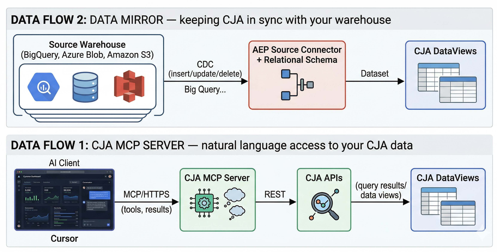

> 📝 **Note:** Data Mirror requires a one-time setup in AEP (schema, dataset, source connector). Once configured, it runs continuously. The CJA MCP Server is already hosted — you connect to it in Lesson 2 with a single JSON config entry.

---

**🚦 Before you begin — confirm your setup:**

- You can log in to CJA at [experience.adobe.com](https://experience.adobe.com)
- Cursor is installed and open on your lab computer
- You have your Adobe IMS credentials ready

---

## ⚙️ Environment setup

To prepare our environment today using *Cursor* we have a few setup steps to follow. Begin these steps as soon as you arrive in the lab.

One click Cursor Install


`<a href="https://cursor.com/en/install-mcp?name=cja-mcp&config=eyJ1cmwiOiJodHRwczovL21jcC1nYXRld2F5LmFkb2JlLmlvL2NqYS9tY3AifQ==" target="_blank" rel="noreferrer">`
  ``
`</a>`

If the above does not work on your lab machine, continue to the 

### 🖥️ Setup 1: Open Cursor

Cursor is the sdk platform we will use today with the CJA MCP server. Open it from your application list.


### 📦 Setup 2: Clone our Git repository

This step is a simple way to download files we need. In Github, the terminology is that we are cloning a public repository.

1. Cursor will open to a black window like this. Click on the *Clone repo* option.


2. In the text bar that has appeared, paste the following URL and click *Clone from URL*.

```
https://github.com/Adobe-Experience-Cloud/adobe-analytics-mcp-lab
```


3. Select any location, such as the desktop, for the repo to be saved.

*IMAGE:mac finder type window*

Your screen should look similar to this, afterward:

*IMAGE:cursor window*

### 🔧 Setup 3: Config Cursor

Now, we just need to tell Cursor how to reach CJA and help us connect.

1. Open an agent chat via ______.

*IMAGE:agent chat open button*

2. Paste this prompt into chat so Cursor use the CJA MCP server info from our download.

```
Add my cja mcp server to the global Cursor settings.
```


This should process quickly, taking only a few seconds. Instead of clicking through Settings menus, we are using the downloaded files and the Composer agent in Cursor to automate setup.

3. Submit this prompt to open web authentication for CJA.

```
Authenticate to CJA using mcp_auth.
```

As before, this should only take a few seconds. Cursor will hopefully make a call and produce this interactive result for you. Click *Authenticate*:


4. On web auth, select *Experience Showcase* (if asked) and click OK.

*IMAGE: org choice*

5. On the following screen, click *Allow access*:


Now, Cursor should say some positive comments about being connected. If so, you can confirm the connection to CJA is active with a prompt like this:

```
What data views can I access?
```

If Cursor returns a small list including the L611 data view, then you are ready! *Leave the Cursor app alone until we get to the MCP tasks in a few minutes.*


### 🛠️ Manual setup instructions

**⚠️ Problems connecting?**
If any of the steps above didn't work, here are the manual click instructions to ensure you are setup for Cursor.

1. In Cursor, go to **Settings → Tools & MCP → Add New MCP Server**.
2. An editor opens with `mcp.json`. Paste the following configuration and save:

   ```json
   {
     "mcpServers": {
       "cja": {
         "type": "streamable-http",
         "url": "https://mcp-gateway.adobe.io/cja/mcp"
       }
     }
   }
   ```
3. Back in **Settings → Tools & MCP**, find the **cja** server entry and click **Connect**.
4. A dialog asks for permission to open the authentication page — click **Open**.
5. Your browser opens the Adobe Experience Platform login. Sign in with your credentials, select your organization when prompted, and click **Allow access**.
6. After authentication, the browser shows a dialog asking to open Cursor — click **Open Cursor.app**.
7. The CJA server should now show as connected, with tools listed below it.

> 🔧 **Troubleshoot:** If CJA tools don't appear after authentication, go back to **Settings → Tools & MCP**, click **Disable** on the CJA server, then click **Enable**. The tools will be available in your next Agent chat.

To verify the connection, open a new Agent chat and type:

```
Are my CJA tools connected?
```

The agent should respond with a list of available tools. If it does, you're all set.

---

## 🪞 Lesson 1 of 4 — Data Mirror

⏱️ Est. completion: 10 min *(No Cursor needed for this lesson)*

---

### 🎯 1.1 Objectives

By the end of this lesson you will be able to:

- Explain what Data Mirror does and the problem it solves
- Identify the descriptor fields a relational schema requires for CDC
- Follow a complete Data Mirror pipeline: source data → schema → dataflow → CJA

### 🔄 1.2 What is Data Mirror?

Most analytics teams have the same problem: data in CJA goes stale. A product price changes in the warehouse, a campaign ends, a customer profile updates — but CJA doesn't know until someone runs an export script and re-uploads a file. By then the data is hours or days old.

**Data Mirror** is an Adobe Experience Platform capability that solves this by enabling row-level change ingestion from external databases into the AEP data lake using **relational schemas** and **Change Data Capture (CDC)** [1]. When a record is inserted, updated, or deleted at the source, that change flows through to AEP — and from there to CJA — without any manual intervention.

Let's see a change data feed in action. In the example below, we start with three rows in **state 1**. Between state 1 and state 2, two things happen: Razvan's row is **deleted** and Rene's role is **updated** from Engineer to Architect. The change feed on the right captures exactly these two operations — a `delete` for row 2 and an `update` for row 3 — along with a version timestamp so the system knows the order. **State 2** reflects the result: Razvan is gone and Rene's role has changed. This is the core mechanic behind Data Mirror — only the changes move, not the entire table.

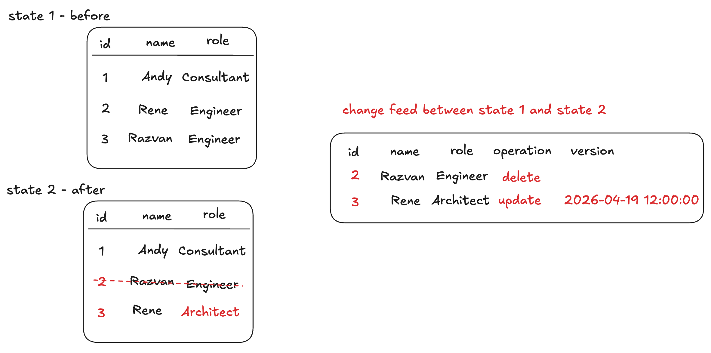

| Method                        | Best For                                   | Supports Updates/Deletes                   |
| ----------------------------- | ------------------------------------------ | ------------------------------------------ |
| Flat file / CSV upload        | One-time or ad-hoc loads                   | No                                         |
| Incremental source connectors | Append-only data streams                   | Inserts only                               |
| **Data Mirror (CDC)**   | **Live sync with mutation tracking** | **Yes — inserts, updates, deletes** |

A complete Data Mirror pipeline has been set up for this lab. This lesson walks through each layer so you can see how the pieces connect.

### 🗄️ 1.3 The Source Data

The lab dataset is built around **Luma**, a fictional retail brand. Four tables across three cloud sources:

| Table                 | Type                  | Source             | Records | Purpose                                                  |
| --------------------- | --------------------- | ------------------ | ------- | -------------------------------------------------------- |
| `web_traffic`       | Time Series / Event   | Google BigQuery    | 1,000   | Clickstream events (page views, purchases, cart actions) |
| `customer_profiles` | Record / Profile      | Google BigQuery    | 200     | Customer identity, loyalty tier, region                  |
| `products`          | Record / Lookup       | Azure Blob Storage | 50      | Product catalog with category and price                  |
| `campaigns`         | Time Series / Summary | Amazon S3          | 5       | Campaign windows, Jan–Feb 2026                          |

**Entity Relationship Diagram:**

```
┌──────────────────────────────────────┐
│         customer_profiles            │
│  (Record/Profile — BigQuery)         │
├──────────────────────────────────────┤
│ PK  person_id         VARCHAR        │
│     first_name        VARCHAR        │
│     last_name         VARCHAR        │
│     email             VARCHAR        │
│     loyalty_tier      VARCHAR        │
│     region            VARCHAR        │
│     signup_date       DATE           │
│  V  version_time      DATETIME       │
└───────────────▲──────────────────────┘
                │
                │ person_id (N:1)
                │
┌───────────────┴──────────────────────┐                ┌───────────────────────────────────────┐
│           web_traffic                │                │          products                     │
│  (Time Series/Event — BigQuery)      │                │  (Record/Lookup — Blob Storage)       │
├──────────────────────────────────────┤                ├───────────────────────────────────────┤
│ PK  event_id          VARCHAR        │  product_id    │ PK  product_id        VARCHAR         │
│  V  version_no        INT            │   (N:1)        │     product_name      VARCHAR         │
│  T  event_timestamp   DATETIME       ├───────────────►│     category          VARCHAR         │
│ FK  person_id         VARCHAR        │                │     price             DECIMAL         │
│     event_type        VARCHAR        │                │     description       VARCHAR         │
│ FK  product_id        VARCHAR        │                │  V  last_modified_time DATETIME       │
│     page_url          VARCHAR        │                └───────────────────────────────────────┘
│     device_type       VARCHAR        │
│     browser           VARCHAR        │
│ FK  campaign_id       VARCHAR        │
└───────────────┬──────────────────────┘
                │
                │ campaign_id (N:1, nullable)
                │
┌───────────────▼──────────────────────┐
│           campaigns                  │                ╔═══════════════════════════════════════╗
│  (Time Series/Summary — S3)          │                ║  LEGEND                               ║
├──────────────────────────────────────┤                ║  PK  Primary Key                      ║
│ PK  campaign_id       VARCHAR        │                ║  V   Record Version                   ║
│  V  campaign_version  DATETIME       │                ║  T   Record Timestamp (time series)   ║
│  T  timestamp         DATETIME       │                ║  FK  Foreign Key                      ║
│     campaign_name     VARCHAR        │                ╚═══════════════════════════════════════╝
│     campaign_description VARCHAR     │
│     start_time        DATETIME       │
│     end_time          DATETIME       │
└──────────────────────────────────────┘
```

| Relationship      | From            | To                    | Cardinality      | Join Key        |
| ----------------- | --------------- | --------------------- | ---------------- | --------------- |
| Event → Person   | `web_traffic` | `customer_profiles` | N : 1            | `person_id`   |
| Event → Product  | `web_traffic` | `products`          | N : 1            | `product_id`  |
| Event → Campaign | `web_traffic` | `campaigns`         | N : 1 (nullable) | `campaign_id` |

### 📋 1.4 The Source Tables

Each source table contains fields that Data Mirror uses as descriptors.

Descriptor fields per table:

| Table                 | Primary Key     | Version Descriptor                           | Timestamp Descriptor | Notes                                               |
| --------------------- | --------------- | -------------------------------------------- | -------------------- | --------------------------------------------------- |
| `web_traffic`       | `event_id`    | `version_no` (integer, increments 0→1→2) | `event_timestamp`  | BigQuery native CDC                                 |
| `customer_profiles` | `person_id`   | `version_time` (datetime)                  | —                   | BigQuery native CDC                                 |
| `products`          | `product_id`  | `last_modified_time` (datetime)            | —                   | Cloud storage: uses `_change_request_type` column |
| `campaigns`         | `campaign_id` | `campaign_version` (datetime)              | `timestamp`        | Cloud storage: uses `_change_request_type` column |

Two versioning patterns are in use:

- **Integer** — `web_traffic` uses `version_no` (0→1→2)
- **DateTime** — `customer_profiles` uses `version_time`, `products` uses `last_modified_time`, `campaigns` uses `campaign_version`

Both patterns are supported by Data Mirror.

### 📐 1.5 The Relational Schemas

Standard XDM schemas in AEP are append-only. The schemas for this lab use **relational schemas**, which enable mutation tracking through descriptors [1]:

- **Primary key** — unique row identifier
- **Version descriptor** — integer or timestamp used to reconcile out-of-order changes
- **Timestamp descriptor** — required for time-series schemas

Each relational schema is created with a behavior type — **Record** or **Time series**:

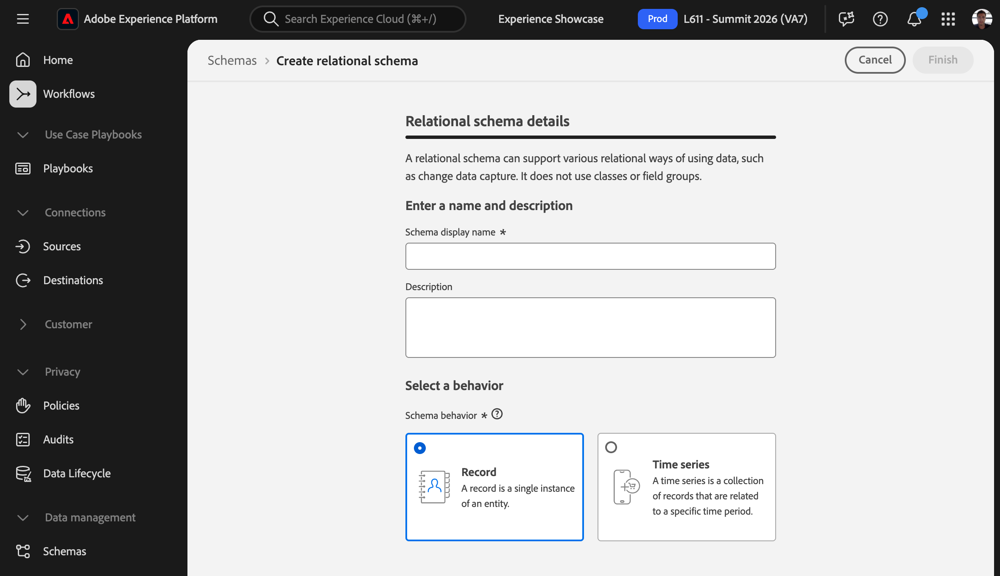

**Time series example: `web_traffic`** — uses all three descriptors.

BigQuery source schema:

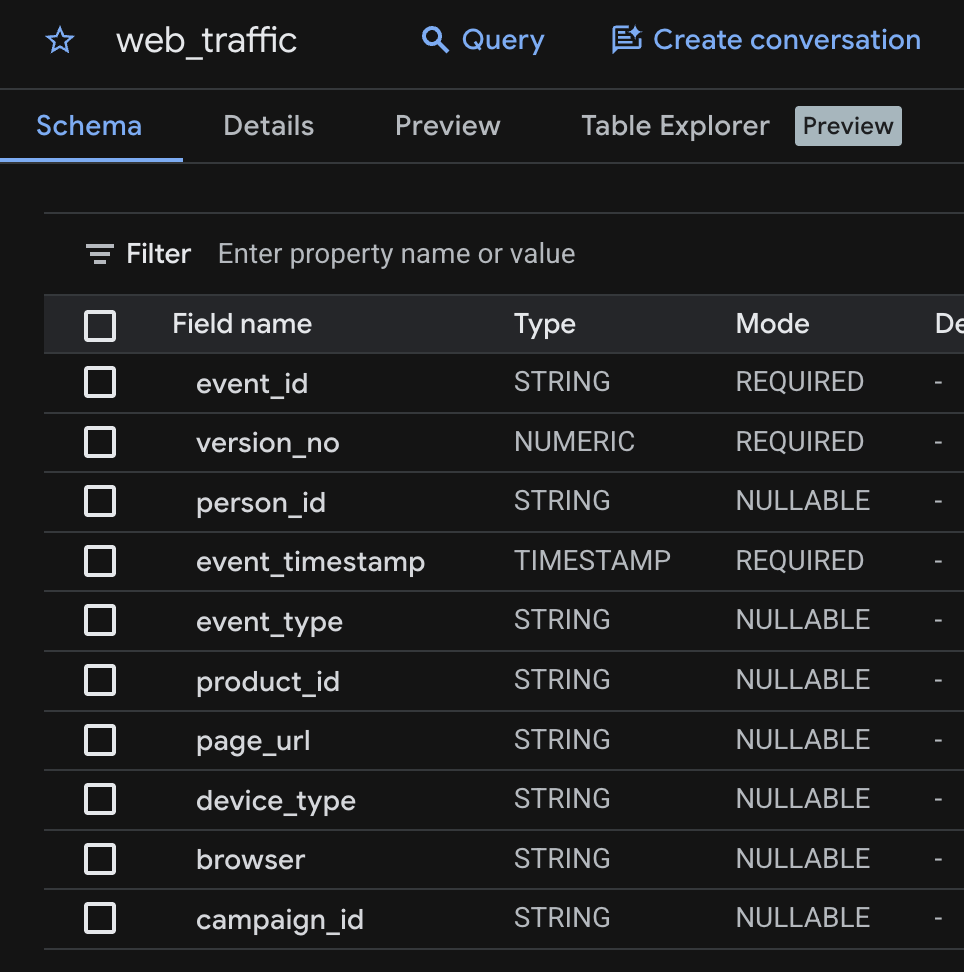

AEP relational schema:

- **Primary key** — `event_id`
- **Version descriptor** — `version_no`
- **Timestamp descriptor** — `event_timestamp`

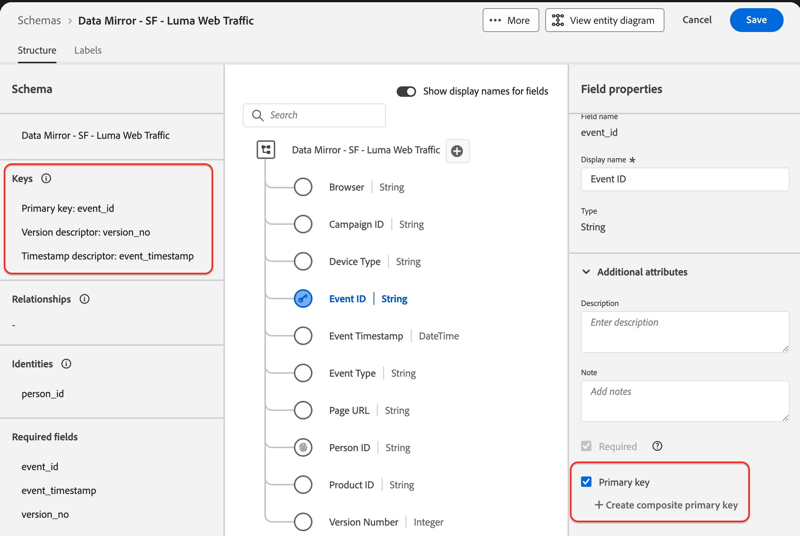

**Record example: `products`** — uses only two descriptors (no timestamp descriptor needed):

- **Primary key** — `product_id`
- **Version descriptor** — `last_modified_time`

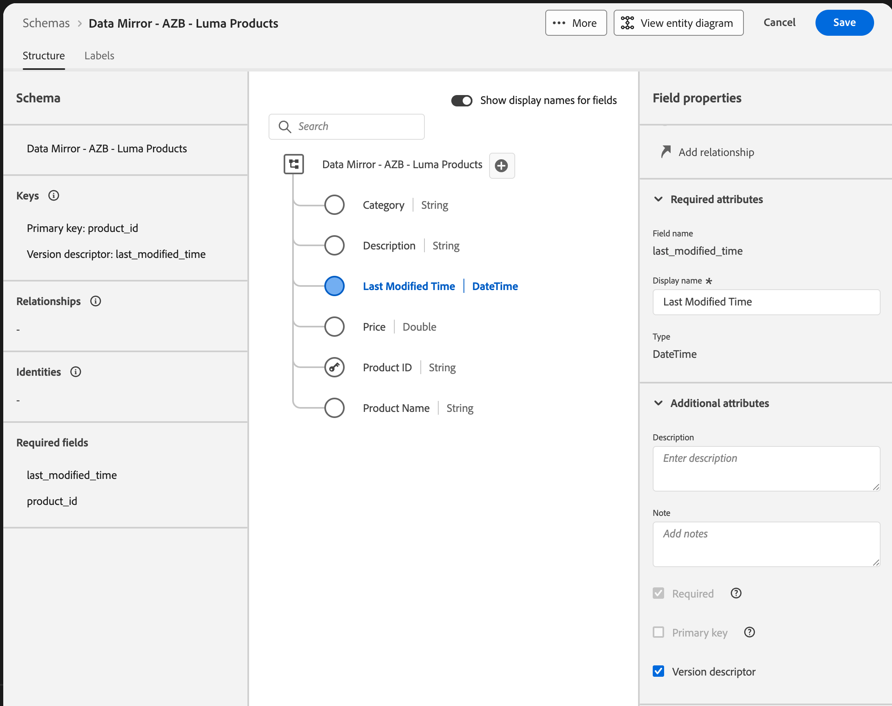

### 🔀 1.6 The CDC Dataflows

With schemas in place, source connectors move the data. All four dataflows are configured from the three source accounts for this lab in AEP:

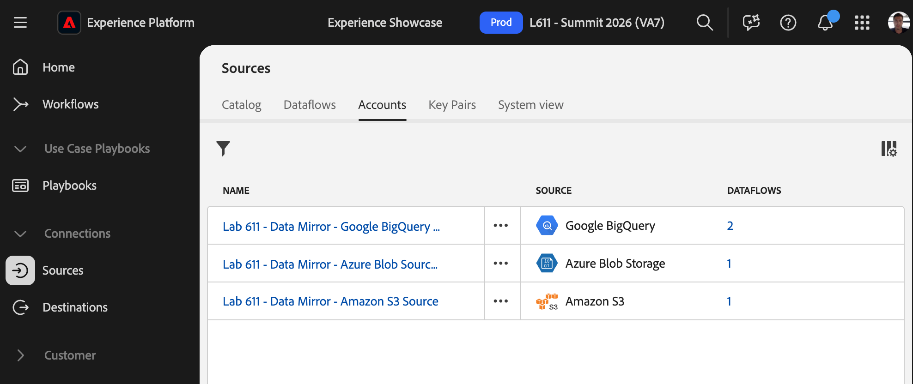

Each dataflow has **Enable change data capture** toggled on. This requires a relational schema with primary key and version descriptor on the target dataset:

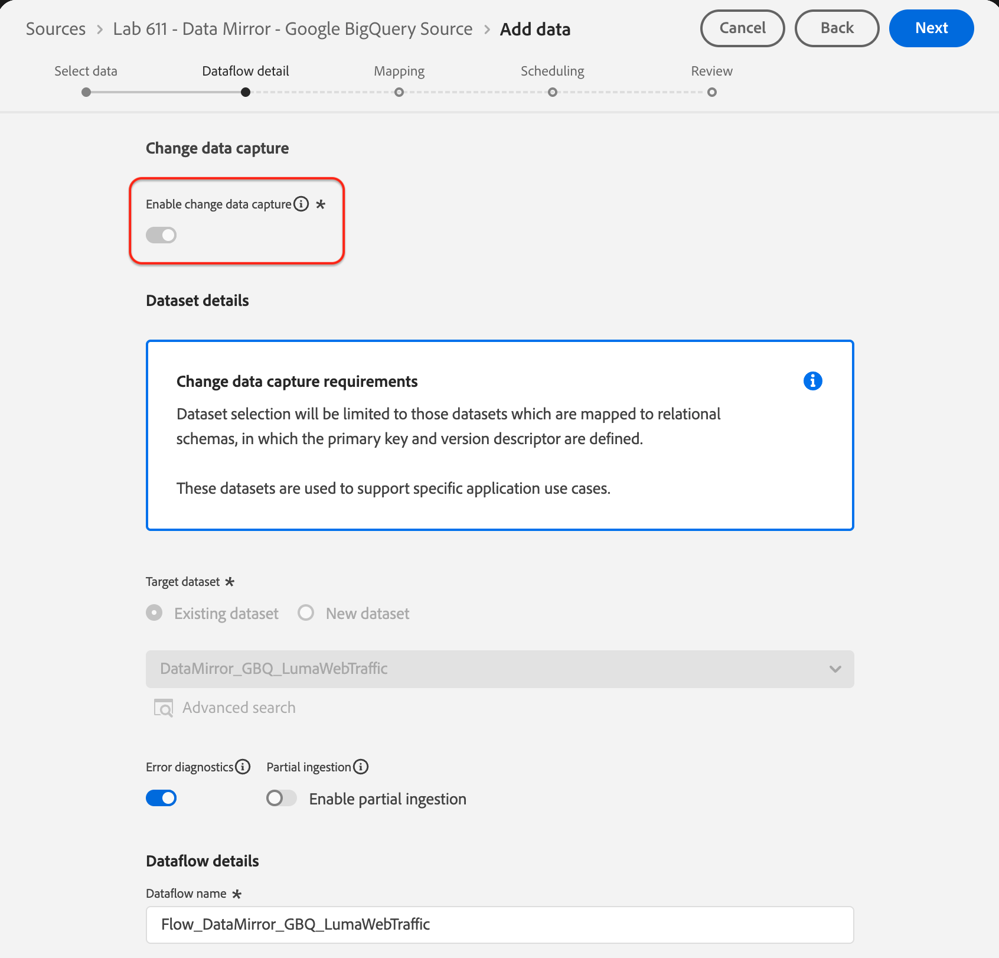

**CDC behavior by source type:**

- **Database sources** (BigQuery, Snowflake, Delta Lake) — CDC is handled natively. Change history was enabled once per table:

  ```sql
  ALTER TABLE `<gcp_project>.adobesummit26lab611.web_traffic`
    SET OPTIONS (enable_change_history = true);
  ALTER TABLE `<gcp_project>.adobesummit26lab611.customer_profiles`
    SET OPTIONS (enable_change_history = true);
  ```

  > 📝 **Other databases:** The concept is the same — enable change tracking at the table level. Here's what it looks like in Snowflake and Databricks:
  >
  > **Snowflake:**
  >
  > ```sql
  > ALTER TABLE web_traffic SET CHANGE_TRACKING = TRUE;
  > ```
  >
  > **Databricks (Delta):**
  >
  > ```sql
  > ALTER TABLE web_traffic SET TBLPROPERTIES (delta.enableChangeDataFeed = true);
  > ```
  >
- **Cloud storage sources** (Azure Blob, S3) — signal operations via a `_change_request_type` column: `"u"` for upsert (insert or update), `"d"` for delete. Evaluated during ingestion only; not stored or mapped to XDM fields [2].

Once configured, the dataflows run continuously. Here are the active flows for this lab:

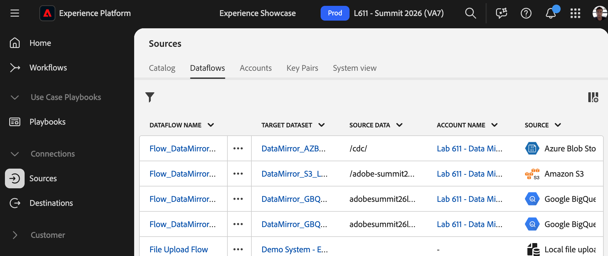

### ✏️ 1.7 The Changes

With the dataflows running, the following changes were applied at the source for this lab session.

**Database changes (BigQuery):**

```sql
-- 1. DELETE all events on March 15
DELETE FROM `<gcp_project>.adobesummit26lab611.web_traffic`
WHERE CAST(event_timestamp AS DATE) = '2026-03-15';

-- 2. INSERT 3 new events on March 18
INSERT INTO `<gcp_project>.adobesummit26lab611.web_traffic`
  (event_id, version_no, person_id, event_timestamp, event_type,
   product_id, page_url, device_type, browser, campaign_id)
VALUES
  ('EVT-200001', 0, 'daniel.thompson10001@example.com', '2026-03-18T09:15:00Z',
   'page_view', 'PROD-1005', 'https://luma.retail.example.com/', 'desktop', 'Chrome', ''),
  ('EVT-200002', 0, 'paul.davis10002@example.com', '2026-03-18T09:32:00Z',
   'product_view', 'PROD-1012', 'https://luma.retail.example.com/shop/footwear', 'mobile', 'Safari', ''),
  ('EVT-200003', 0, NULL, '2026-03-18T10:05:00Z',
   'search', 'PROD-1023', 'https://luma.retail.example.com/search', 'desktop', 'Firefox', '');

-- 3. Rename Anthony Harris → Anthony Harris Jr.
UPDATE `<gcp_project>.adobesummit26lab611.customer_profiles`
SET last_name = 'Harris Jr.',
    version_time = CURRENT_TIMESTAMP()
WHERE person_id = 'PER-10091';
```

BigQuery's [change history](https://docs.cloud.google.com/bigquery/docs/change-history) captures these automatically — no `_change_request_type` column needed.

**Cloud storage changes (Azure Blob)** — A CDC file `products_changes.json` was uploaded:

```json
[{
  "product_id": "PROD-1001",
  "product_name": "Classic Cotton T-Shirt",
  "category": "Apparel",
  "price": 24.99,
  "description": "Soft 100% cotton crew-neck tee in assorted colors",
  "last_modified_time": "2026-03-24T12:00:00Z",
  "_change_request_type": "u"
},
{
  "product_id": "PROD-1003",
  "product_name": "Lightweight Running Jacket",
  "category": "Apparel",
  "price": 119.99,
  "description": "Water-resistant jacket with reflective trim",
  "last_modified_time": "2026-03-24T12:00:00Z",
  "_change_request_type": "d"
}]
```

Data Mirror matches on `product_id` and reads `_change_request_type`:

- `"u"` — upsert (insert or update): the newer `last_modified_time` replaces the existing record
- `"d"` — delete: the row is removed

Across both sources, these operations exercise every CDC mutation type: **delete**, **insert**, **update**.

### 🔗 1.8 Adding Data Mirror Datasets to CJA

Once the datasets land in the AEP data lake, the next step is adding them to a CJA connection. When you add a relational XDM dataset, CJA asks you to classify it based on the schema's behavior type:

| Schema Behavior       | CJA Dataset Type          | Use Case                                                           |
| --------------------- | ------------------------- | ------------------------------------------------------------------ |
| **Time Series** | **Event** dataset   | Clickstream, transactions — rows with a timestamp per interaction |
| **Time Series** | **Summary** dataset | Aggregated data — campaign-level totals, daily rollups            |
| **Record**      | **Profile** dataset | Person-level attributes — identity, loyalty tier, region          |
| **Record**      | **Lookup** dataset  | Reference tables — product catalog, campaign metadata             |

In this lab, the four datasets map as follows:

- `web_traffic` → **Event** (time series — individual clickstream hits)
- `campaigns` → **Summary** (time series — campaign-level aggregates)
- `customer_profiles` → **Profile** (record — one row per person)
- `products` → **Lookup** (record — one row per product)

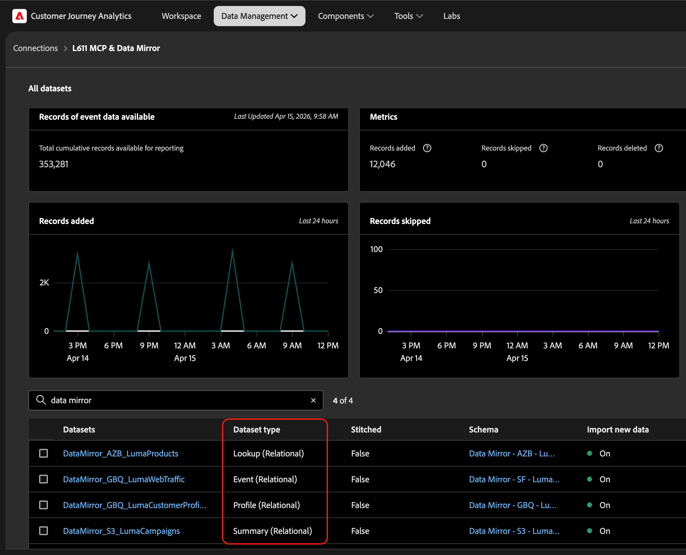

Once the connection is saved, CJA ingests the datasets and respects the CDC operations — inserts, updates, and deletes all carry through into your data views and reports.

### 👀 1.9 See the Results in CJA

Two setups are running during this session:

- **Live setup** — changes are being applied now
- **Pre-run setup** — same changes applied earlier, already fully propagated

Open CJA on your lab computer and find the pre-run freeform table. Observe:

- **March 15** shows **0 events** — the delete propagated
- **PROD-1001 (Classic Cotton T-Shirt)** shows **$24.99** — the price update propagated
- **PROD-1003 (Lightweight Running Jacket)** no longer appears — the product delete took effect
- **PER-10091** shows **Harris Jr.** — the customer profile update propagated

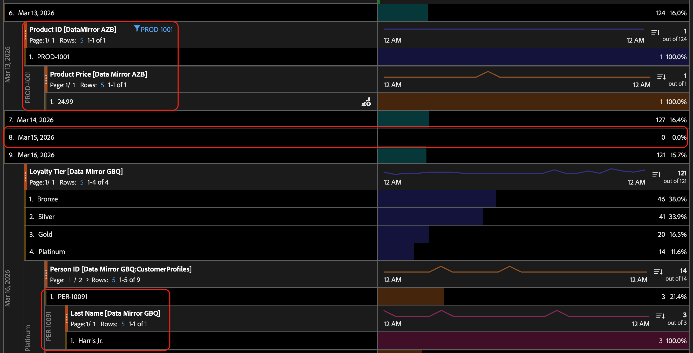

This is the end state the live setup will reach once its propagation completes.

### 💡 1.10 Checkpoint

Before moving on, consider:

- What happens in CJA when a record is **deleted** at the source? Does it disappear from reports?
- What are the three descriptor fields a relational schema must define for CDC to work?
- Name a data scenario in your own work where Data Mirror would be more useful than a batch connector.

---

---

## Lesson 2 of 4 — CJA MCP Server and skills

⏱️ Est. completion: 10 min

---

### 🎯 2.1 Objectives

By the end of this lesson you will be able to:

- Explain what MCP is and how it enables AI-to-CJA connectivity
- Verify that CJA tools are available in an Agent chat
- Create simple and advanced CJA projects using natural language

### 🔌 2.2 What is MCP?

**MCP (Model Context Protocol)** is an open standard for connecting AI applications to external data sources and tools. It provides a universal interface so AI clients — Cursor, Claude.ai, ChatGPT — can securely access live data and take actions on your behalf, without requiring a custom integration for each platform.

MCP is like an API for AI/LLM agents. You chat conversationally with AI tool like normal but now that AI platform can connect to CJA to pull data, build a dashboard, check components, etc.

**What the CJA MCP Server exposes:**

| Category      | What you can do                                                                   |
| ------------- | --------------------------------------------------------------------------------- |
| Discovery     | Find data views, dimensions, metrics, segments, date ranges, projects             |
| Reporting     | Run freeform reports, search dimension items                                      |
| Creation      | Create and update workspaces, segments, calculated metrics                        |
| Governance    | List component usage, find similar components, find frequently co-used components |
| Configuration | Set session defaults (data view, context)                                         |

Instead of navigating Analysis Workspace manually, you describe what you want: *"Show me my core product fields by geo for the last 30 days"* — the agent runs the query and returns results directly.

**How it differs from Data Insights Agent in CJA/AEP**

In the CJA UI, there is a feature called Data Insights Agent or AI Assistant. It will answer simple information requests, report updates, etc. but only within your CJA/AEP context. The MCP server facilitates those too, but it is the power of the chat agent you use which takes it farther. You can give an AI like ChatGPT a complex prompt, with external references, instructing it to generate a unique CJA report app for you. This lab will explore the possibilities.

AI Assistant and Data Insights Agent in CJA:


### 🧠 2.3 What are **skills**?

**Skills** represents the way you can share task or context knowledge across instances of an AI chat. After wrestling an AI to doing something just the way you want it, you can ask it to save the capability as a skill, in hopes that it will be repeatable and shareable when you or another opens a brand new AI conversation.

Skills are the sheet of notes that you give to an AI to help it replicate a scenario it doesn't know.


### 🏗️ 2.4 The *Project builder* skill

With the MCP server connected, you can describe what you want to analyze and let the agent build it. The server provides a minimal framework to the LLM that connects to it: pull reports like this, update projects like that, etc. No additional context is *required* - yet there are nuances an LLM might miss.

To aid repeatability and demonstrations in our lab, we have defined the `cja-project-builder` **skill**. It guides the agent through a structured workflow: it discovers your available components, assembles a complete project definition, and calls `upsertProject` to create the workspace in CJA. For advanced, specific, repeatable tasks, skills can give us helpful guardrails and *repeatability* (usually). To show cool things and keep attendees' instances on the same track, we will use skills.

> 📝 **Note:** For our lab today, we suggest using the prompts listed and following along. If you want to try something additional, use a separate agent chat so that you can still explore the prepared skills and ideas we have. The lab goal is to show a breadth of possibilities with *reasonably consistent* exercises, but in practice, iterations are typically required.

1. Open a new agent chat.


2. Specify the data view for our session:

```
Set L611 as my default data view for this session.
```


The agent calls `setDefaultSessionDataViewId` — now every subsequent call in this agent instance uses this data view. If not specified, the agent would assume or ask as it deemed applicable.

3. Create a basic CJA project:

```
Make a simple CJA project.
```


> 📝 **Note:** This uses the `project builder` skill. A skill is used by the AI based on its headers (or you may invoke it explicitly). In our Cursor environment, if we use phrases like *make/build a CJA project* or reference `@cja-project-builder`, the agent will follow the skill to address the prompt.

The skill provides a basic project definition to the LLM, which creates the project and return its link.

4. Ask a data question:

```
How many people saw each azb product in March?
```

This is a followup from our data mirror example. Even though the prompt is a bit vague, the LLM infers context. Here, it responds conversationally with CJA data directly in our chat.


You will probably receive a similar text representation of the product names and people counts.


5. Save it into a project:

```
Save this in a project and give me the link.
```


6. Try a more interesting CJA project:

```
Create an e-commerce performance dashboard for the Luma retail data. Show revenue, orders, and conversion rate for the last 30 days, broken down by product category. Include a line chart for the daily revenue trend.
```

The agent responds with a proposed structure and builds it. It uses context from your skills, chat, common reporting and ecommerce knowledge, and existing components in CJA. Panels, visualizations, dimensions, metrics are all driven through that lens.

Hopefully, your result takes only a minute or two. The timing and result will vary with AI. If something looks wrong or you want a change, you would continue the conversation. Even skills require iterations to reach your exact goal, sometimes.

> 💡 **Tip:** Be specific in your prompts. Whenever possible, use clear time ranges ("last 30 days"), metric names ("orders", "revenue"), and dimensions ("product category") when you know them.

7. Request a *component survey* project:

```
Build a survey for the top 9 dimensions in L611.
```

> 📝 **Note:** This will take a few minutes to run. We will continue into the lab, so you may open a new agent chat while this runs.

This uses a skill named *dimension survey*. It creates an organized project view of n dimensions, starting with the most frequently used components. It skips generic time or out-of-the-box dimensions and emphasizes non-null dimensions.

Frequently supporting new customers and unknown data views, I wanted a quick survey of the data environment. Doing this for many dimensions becomes tedious or impossible to recreate. I have successfully run this skill for up to 60 dimensions.

> **Note:** This is a product of iterative conversations. Build a draft, request changes, update the skill, try again. As CJA projects grow in size and take more of the context window, it becomes harder for an MCP to stay on track. Keep skills thin and efficient for success.

### 💡 2.5 Checkpoint

What manual or tedious tasks could this system build for you? Don't force a use case onto the feature, but dream big when scale and manual tasks are a blocker.

Consider:

- Building a large survey workspace manually can take a while. What would you build first for your own team using this approach to circumvent repetitive tasks?
- The agent called several MCP tools in sequence: `findDataViews`, `setDefaultSessionDataViewId`, `findMetrics`, `findDimensions`, `upsertProject`. You didn't need to know any of those tool names. What does that tell you about how MCP changes the analyst workflow?
- What's one thing you'd want to add to the workspace you just created?

---

## 🧩 Lesson 3 of 4 — Segment Builder

⏱️ Est. completion: 15 min

---

### 🎯 3.1 Objectives

By the end of this lesson you will be able to:

- Develop simple segments using plain-language descriptions
- Develop complex, sequential, nested segments
- Converse about the proposed segment with the agent before creation and save
- Receive advice from your LLM segment expert

### 🔨 3.2 The *Segment builder* skill

This skill augments the LLM and MCP context of segmentation with expertise from an experienced practitioner. `cja-project-builder` introduces business logic, common interpretations, translation to CJA segments, communication strategies, etc. It has been developed through material built by experienced practitioners.

This skill is activated any time we ask to create or update a segment.

> **Note:** Each segment creation also includes a summary with a *validation* step. This is not especially effective so far. I leave it in to show the aspiration of not only translating and honing a definition but going all the way through validation. It is a complex task that likely will become its own skill.


### 3.3 Simple segments

A basic segment uses AND/OR logic to filter visitors, visits, or hits based on dimensions and metrics. This is the most common segment type. It's not especially difficult to create, but let's start here.

1. Open a new Agent chat.

2. Create this simple segment:

```
   Create a demo segment for mobile visitors.
```

The agent interprets the appropriate containers, components, logic. It also scans for similar segments. If there is little or no ambiguity, it creates the segment automatically. Otherwise, it asks first. In both cases, it provides a description with a text-based proposal of the segment definition.

We add *demo* to our request to bypass the *do-not-duplicate* caution that the skill normally raises. We are asking it to create a segment that is already in our environment, because of testing together like this - but we want it to create a new one, anyway.


3. Create this segment:

```
   Create a demo segment for mobile visitors who viewed a product
   but didn't complete a purchase in the same session.
```


### 3.4 Complex segments

Sequential segments use THEN logic — *"first X happened, then Y happened."* They are the most powerful segmentation capability in CJA/AA and also the trickiest to apply. The skill should help with interpreting plain language and with manual build mechanics.

1. Create this segment:

```
   Create a demo segment for visitors who viewed the Collections page and then made a purchase within 2 days.
```


1. In the same or a new Agent chat (the skill is already loaded):
2. **Prompt:**

```

```

3. The agent identifies this as a sequential segment. It proposes:

- **Scope:** Visitor level
- **Sequence:** Checkpoint 1 → Page Name contains "collections" → THEN within 2 days → Checkpoint 2 → Event Type = purchase
- The underlying API structure uses `sequence` with a `time-restriction` element between checkpoints

4. Review the logic, then confirm:

```
   Yes, create it.
```

5. **Optional — test the segment:**

```
   Run a quick report with this segment to see how many visitors qualify over the last 30 days.
```

   The agent calls `runReport` with the new segment applied.

> 📖 **Sequential pattern reference:**
>
> | Pattern                       | What it means                                                    |
> | ----------------------------- | ---------------------------------------------------------------- |
> | **THEN**                | `sequence` — checkpoint A happened, then checkpoint B         |
> | **THEN within X days**  | `time-restriction` element between checkpoints in the sequence |
> | **Everything before X** | `sequence-suffix` — "only before X occurred"                  |
> | **Everything after X**  | `sequence-prefix` — "only after X occurred"                   |
> | **A not followed by B** | `sequence` with `exclude-next-checkpoint` — A then "not B"  |

### 🏆 3.4 Exercise: Complex Segment Challenge

Try building this segment on your own. It combines multiple concepts: a distinct count condition, scope nesting, and a date-based exclusion.

**Prompt to try:**

```
Build a segment for hits during sessions where the visitor
viewed at least 3 different product categories,
but exclude sessions that happened on December 27, 2025.
```

What the agent will need to do:

- Apply a **distinct count modifier** (3 distinct values of Product Category) at the visit level
- Apply a **visitor-level exclusion** for a specific date (Day = Dec 27, 2025, using its item ID)
- Nest the conditions correctly: visit-level condition AND visitor-level exclusion

Watch how the agent breaks down the problem and what clarifying questions it asks.

> 📝 **Note:** Building this segment manually in the CJA UI requires knowing about Distinct Count operators, correct container nesting, and how date dimensions are stored as item IDs. The agent handles all of this — your job is to describe the intent clearly.

### 💡 3.5 Checkpoint

Reflect on what you built:

- You just created three segments in 15 minutes — from plain language to live CJA segments. What would the same work look like without the MCP server?
- Look at the sequential segment. The underlying JSON for a `sequence` with a `time-restriction` is about 40 lines of nested objects. How does the agent's plain-language summary help you verify correctness without reading the JSON?
- Where else outside CJA could you use segment logic? *(Think: the same filtering logic you just described could describe a SQL WHERE clause or a BigQuery filter.)*

---

---

## 🔌 Lesson 4 of 4 — Sneak Peek: The Analytics Plugin Marketplace

⏱️ Est. completion: 15 min *(Hands-on in Cursor — preview two skills from the upcoming CJA plugin)*

All operations in this lesson are **read-only** — the skills report and analyze but never modify anything.

---

### 🎯 4.1 Objectives

By the end of this lesson you will be able to:

- Explain what the Analytics Plugin Marketplace is and how it bundles skills with MCP server configuration
- Describe the difference between skills in a Git repo and skills in an installable plugin
- Deep-dive into a dimension's cardinality and data quality using the Dimension Analysis skill
- Run a full component audit across segments and calculated metrics using the Component Audit skill

### 🏪 4.2 From Skills to Plugins

In Lessons 2 and 3, you loaded skills from the Git repository you cloned at the start of the lab. That works — but it requires manual setup: clone a repo, point your client at the right folder, hope nothing drifts between versions. For a handful of skills in a lab setting, that's fine. For a production analytics team managing dozens of skills across CJA and Adobe Analytics, it doesn't scale.

Adobe is releasing a **Plugin Marketplace** —  that folllows [Anthropic&#39;s Claude plugin marketplace](https://docs.anthropic.com/en/docs/agents-and-tools/claude-code/plugins) specification— that packages everything an AI agent needs into installable plugins:

A plugin is a bundle that packages:

- **MCP server configuration** — the connection to your CJA or AA environment, ready to go
- **A full library of skills** — available the moment you install, no manual loading
- **Version management** — update all skills at once when a new release ships

Analytics is releasing two plugins that will ship alongside the CJA and AA MCP servers:

| Plugin                    | Product                    | Skills    | Install                                                 |
| ------------------------- | -------------------------- | --------- | ------------------------------------------------------- |
| **adobe-cja**       | Customer Journey Analytics | 13 skills | `/plugin install adobe-cja@adobe-analytics-mcp`       |
| **adobe-analytics** | Adobe Analytics            | 14 skills | `/plugin install adobe-analytics@adobe-analytics-mcp` |

One command replaces the clone, the configuration, and the manual skill setup you did earlier today.

**What's in the CJA plugin:**

| Category                        | Skills                                                                      |
| ------------------------------- | --------------------------------------------------------------------------- |
| **Monitor & investigate** | KPI Pulse · Anomaly Triage · Top Movers Watchlist                         |
| **Analyze**               | Funnel Health Check · Dimension Analysis · Segment Performance Comparator |
| **Build**                 | Segment Builder · Calculated Metric Builder · Project Builder             |
| **Govern**                | Segment Audit · Calculated Metric Audit · Component Audit                 |
| **Deliver**               | Executive Briefing                                                          |

The Adobe Analytics plugin mirrors this structure with AA-specific equivalents — plus a Report Suite Comparison skill unique to AA.

> 📝 **Note:** Both plugins ship alongside their respective MCP servers. The servers are the foundation; the plugins give you a curated, versioned skill library on top.

The skills you cloned earlier are the same ones that will ship in the plugin. Let's try two of them now to see what's coming.

### 📊 4.3 Exercise: Analyze a Dimension

Dimensions are the backbone of every CJA report — but most teams have never looked closely at what's actually inside them. High-cardinality dimensions hurt query performance. Skewed distributions mean a few values dominate reporting. Stale or error-laden values silently corrupt analysis.

The Dimension Analysis skill profiles a dimension in depth: cardinality, distribution, trends, anomalies, and data quality — all from a single prompt.

1. Open a new Agent chat:

```
   @cja-dimension-analysis
```

2. **Prompt:**

```
   Analyze the Product Category dimension.
   Show me cardinality, the top values by event count, and any data quality issues.
```

3. The agent returns:

- **Cardinality** — how many distinct values exist
- **Top-N distribution** — which values dominate and by how much
- **Skew** — Gini coefficient and top-N concentration
- **Data quality flags** — unexpected gaps, anomalous spikes, new/disappeared values

> 💡 **Tip:** You can ask follow-up questions: *"Which product categories have the most purchases?"* or *"Are there any category values that appeared recently and might be data quality issues?"*

### 🩺 4.4 Exercise: Run a Component Audit

Over time, every CJA org accumulates component debt: segments nobody uses, calculated metrics that are near-identical copies of each other, components owned by people who left the team two years ago. The Component Audit skill scans your entire library and produces an actionable report — without touching a single thing.

1. In the same or a new Agent chat:

```
   @cja-component-audit
```

2. **Prompt:**

```
   Audit all my components on the [Data View Name] data view.
   Include segments and calculated metrics.
```

3. The agent works through seven phases:

| Phase             | What happens                                                          |
| ----------------- | --------------------------------------------------------------------- |
| 0 — Setup        | Confirms data view and component types                                |
| 1 — Inventory    | Pulls full component lists with metadata, definitions, and timestamps |
| 2 — Usage        | Classifies each component as Active, Stale, or Unused                 |
| 3 — Duplicates   | Compares definitions; flags near-identical formulas and names         |
| 4 — Dependencies | Maps which calculated metrics reference which segments                |
| 5 — Ownership    | Identifies who owns what and flags high concentrations                |
| 6 — Health       | Calculates a health score (0–100) per component type                 |
| 7 — Report       | Generates an HTML dashboard or markdown report                        |

4. When the report is ready, review:

- **Active / Stale / Unused** counts for segments and calculated metrics
- **Duplicate flags** — pairs with identical or near-identical definitions
- **Top recommendations** — what to delete, merge, rename, or archive

> 📝 **Note:** The audit is strictly read-only. It inventories and reports. It never deletes, modifies, or archives components.

> 💡 **Tip:** If the report is large, ask the agent to focus: *"Show me only the unused segments"* or *"Give me the top 5 consolidation recommendations."*

### 💡 4.5 Checkpoint

- The two skills you just ran — Dimension Analysis and Component Audit — are part of a 13-skill plugin. Which other skills from the catalog would be most valuable for your team?
- How does a plugin model (one install, all skills, versioned updates) change the way you'd roll out AI-assisted analytics across your organization?
- The same skill patterns exist for both CJA and Adobe Analytics. If your org uses both products, how would having parallel plugins simplify your workflow?

---

---

## 🎁 Bonus — Explore More

⏱️ Est. completion: 10 min *(Optional — try what interests you)*

---

### 🎯 B.1 Objectives

- See what else is possible with 25 CJA MCP tools
- Experience ad-hoc analysis and app generation through conversation
- Understand where the CJA MCP Server fits relative to Digital Insights Agent

### 🧪 B.2 Exercise: Try One of These

**⚖️ Option A — Comparative Analysis**

Compare two segments or two time periods side by side:

```
Compare revenue and conversion rate between mobile and desktop visitors
for the last 30 days. Then show me how this compares to the same period last month.
```

**🗺️ Option B — Metric Dependency Mapper**

Find out which of your calculated metrics depend on a specific base metric:

```
Show me which calculated metrics use the Orders metric as a component.
If you can, create a simple text map showing their dependencies.
```

**🚀 Option C — Build a Single-Page Dashboard App**

Go beyond the CJA UI entirely:

```
Using the Luma data, build a single-page HTML app that shows
the top 10 products by revenue with a bar chart.
Pull the data live through the CJA MCP tools and render it in the browser.
```

> 📝 **Note:** These prompts go beyond the structured exercises. They're meant to show what's possible when an agent has free access to 25 live CJA tools. Some may require follow-up clarifications.

### 🆚 B.3 MCP vs. Digital Insights Agent

The CJA MCP Server and Adobe's Digital Insights Agent (DIA) are complementary — not competing.

|                         | Digital Insights Agent (DIA)                                   | CJA MCP Server                                                               |
| ----------------------- | -------------------------------------------------------------- | ---------------------------------------------------------------------------- |
| **What it is**    | Pre-built AI-guided analysis workflows within Experience Cloud | Open protocol layer that connects any MCP-capable AI client to live CJA data |
| **Best for**      | Guided, repeatable analysis flows for business users           | Custom, programmatic, and agentic workflows for analysts and developers      |
| **Client**        | Adobe Experience Cloud UI                                      | Cursor, Claude.ai, ChatGPT, or any MCP-compatible client                     |
| **Extensibility** | Adobe-managed                                                  | Scriptable, skill-based, fully extensible                                    |

Use DIA for structured guided analysis within Adobe's UI. Use the MCP Server when you want to write your own skills, combine CJA with other data sources, or drive workflows from an AI coding environment.

---

---

## 🏁 Wrap-up and Q&A

⏱️ Est. completion: 10 min

---

### 🔑 Key Takeaways

1. **Data Mirror** eliminates the export-schedule-import cycle. CDC keeps your CJA data in sync with your warehouse source of truth — inserts, updates, and deletes propagate automatically.
2. **The CJA MCP Server** makes your analytics conversational. Describe what you want; the agent builds it. Workspace creation, segment building, and component governance all work through natural language.
3. **Component governance at scale** is now manageable. A 7-phase audit across hundreds of segments and calculated metrics takes a few minutes of agent work, not a week of manual review.
4. **Segmentation is accessible to everyone.** From a simple AND/OR filter to a multi-step sequential segment with time restrictions — the segment builder handles the JSON complexity so you can focus on the logic.

### 🚀 Next Steps

**To connect the CJA MCP Server to your own org:**
See the *Remote MCPs for Analytics and CJA — Getting Started Guide* in the lab materials. It covers Cursor, Claude.ai, ChatGPT, and non-OAuth (server-to-server) clients.

**To set up Data Mirror for your warehouse:**
See the Data Mirror setup walkthrough in `1 data mirror/` — it covers BigQuery, Azure Blob Storage, and Amazon S3, including schema creation, CDC enablement, and the AEP source connector configuration.

**To explore more skills:**
Open `.cursor/skills/` in this repository. Skills available include: `cja-project-builder`, `cja-segment-builder`, `cja-segment-audit`, `cja-component-audit`, `cja-dimension-analysis`, `cja-component-find-replace`, and `cja-mcp-connectivity`.

**Both capabilities are currently in beta.** Your feedback matters 🙏 — share it with your Adobe team contact or submit it through the lab feedback form.

---

*🔴 Adobe Summit 2026 — Lab L611 — Data Mirror and MCP: Modern Connectivity for Customer Journey Analytics*

---

**References**

[1]: [Data Mirror Overview — Adobe Experience Platform XDM](https://experienceleague.adobe.com/en/docs/experience-platform/xdm/data-mirror/overview)
[2]: [Change Data Capture — Adobe Experience Platform Sources](https://experienceleague.adobe.com/en/docs/experience-platform/sources/api-tutorials/change-data-capture#data-mirror-with-relational-schemas)
